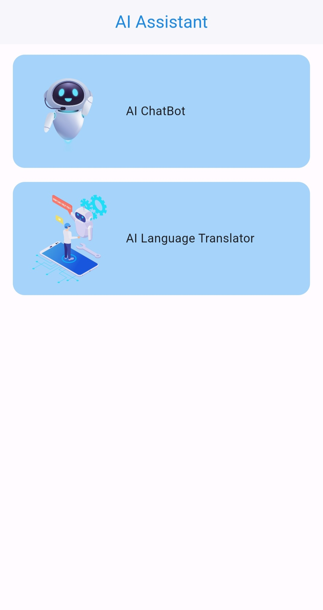
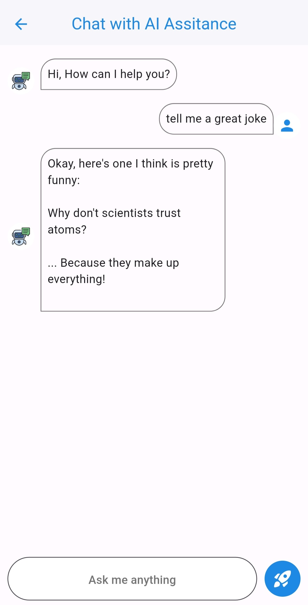
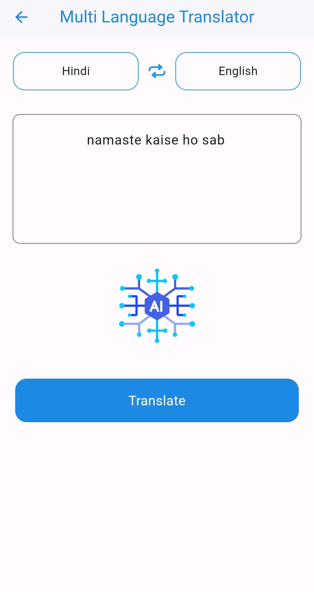
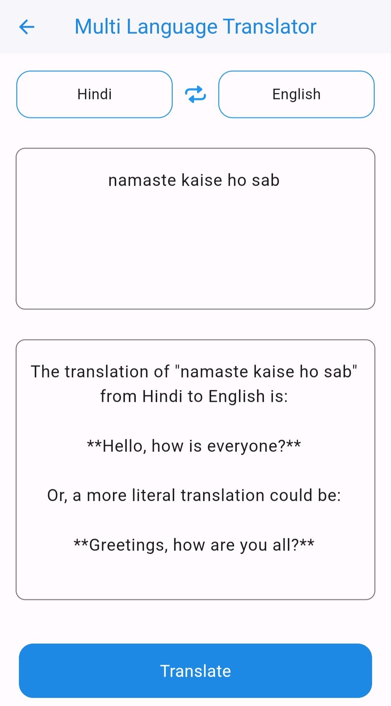

# 🤖 AI Assistant App

An elegant AI-powered assistant app built with Flutter that offers:

- 💬 **Chat with AI Bot** – powered by Gemini Flash 2.5
- 🌐 **Multilingual Translator** – translate your messages into various languages

This app is designed with animated onboarding, interactive UI, and an expressive AI bot to offer a fun and helpful experience.

---

## ✨ Features

- 🚀 Animated Onboarding Flow using Lottie
- 🏠 Smooth, animated Home Screen
- 🤖 AI Chatbot integrated with Gemini Flash 2.5
- 🌍 Translate messages to different languages
- 💾 Local data persistence with Hive and Isar
- ⚡ Fast state management using GetX
- 🎨 Beautiful animations using `flutter_animate` and `animated_text_kit`

---

## 📱 Screenshots

### 🚀 Onboarding Screen


### 🏠 Home Screen



### 🤖 AI Chat Bot



### 🌐 Translator Screen 1



### 🌐 Translator Screen 2



---

## 📦 Dependencies

```yaml
dependencies:
  icons_launcher: ^3.0.0
  lottie: ^3.1.3
  hive: ^4.0.0-dev.2
  isar_flutter_libs: ^4.0.0-dev.13
  path_provider: ^2.1.0
  get: ^4.7.2
  flutter_animate: ^4.5.2
  http: ^1.2.2
  animated_text_kit: ^4.2.3
```

---

## 📲 How to Use

1. **Clone the repository**:

```bash
git clone https://github.com/gautamrawat543/ChtBotAI.git
cd ai-assistant-app
```

2. **Install dependencies**:

```bash
flutter pub get
```

3. **Run the app**:

```bash
flutter run
```

> ✅ Make sure to replace the Gemini API key if required in your `.env` or config file.

---

## 🧑‍💻 Author

**Gautam Rawat**  
GitHub: [@gautamrawat543](https://github.com/gautamrawat543)
